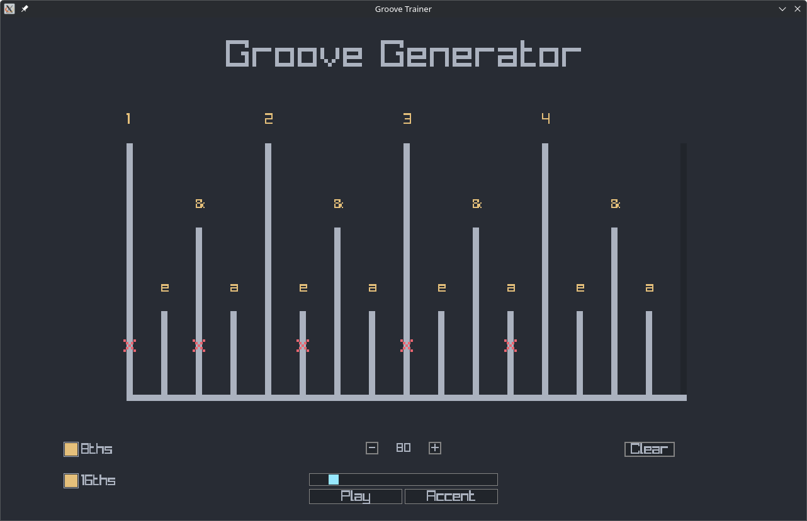

# GrooveGenerator - Raylib-Based Rhythm Generator for Guitarists

[Tech Demo](https://youtu.be/6No4EbDdkJ8)

## Features
- Toggleable 8th and 16th notes
- Metronome synced to BPM
- Accent Button to play marked steps

## Default Keybinds
| Key     | Action               |
|---------|----------------------|
| `Space` | Play Metronome       |
| `R_ALT` | Play Accented Beats  |
| `R`     | Generate Random Beat |
| `C`     | Clear Beat           |
| `X`     | Increase BPM         |
| `A`     | Decrease BPM         |
| `1`     | Set BPM to DEFAULT   |
| `2`     | Set BPM to PRESET_1  |
| `3`     | Set BPM to PRESET_2  |
| `4`     | Set BPM to PRESET_3  |

## Roadmap
- [x] 16-step grid for 16th notes in 4/4 time
- [x] Metronome with sound and BPM control
- [ ] Presets for Practicing
- [ ] Save/load user patterns
- [?] Colorschemes
- [ ] Biased Randomization for grooves

## Credits
Inspired by [Practice This to Improve Your Groove: Rhythm Exercises for Bass Guitar](https://www.youtube.com/watch?v=scSnv1srs5w)
