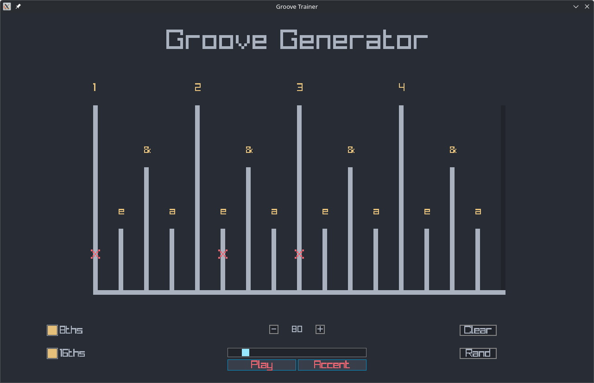

# GrooveGenerator - Raylib-Based Rhythm Generator for Guitarists

[Tech Demo](https://youtu.be/WUvsQRAPjqk)

## Features
- Toggleable 8th and 16th notes
- Metronome synced to BPM

## Roadmap
- [x] 16-step grid for 16th notes in 4/4 time
- [x] Metronome with sound and BPM control
- [ ] Presets for Practicing
- [ ] Save/load user patterns
- [ ] Colorschemes
- [ ] Biased Randomization for grooves

## Credits
Inspired by [Practice This to Improve Your Groove: Rhythm Exercises for Bass Guitar](https://www.youtube.com/watch?v=scSnv1srs5w)
