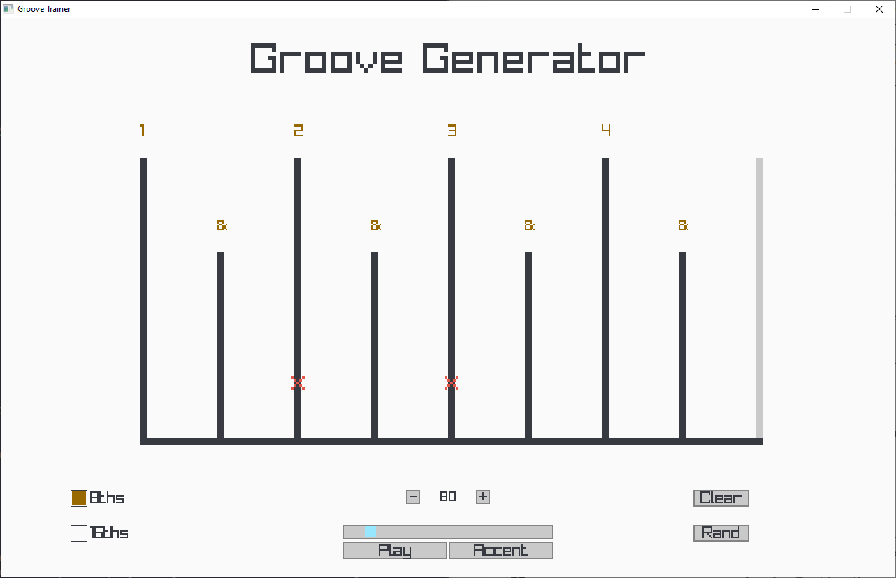

# A Raylib Groove Generator

## 2025-07-25 Project Start
**Goal:** Build a metronome in raylib that:
- Marks beats for when a guitarist has to pick or strum
- has simple controls for changing BPM

### Why?
- Wanted a program for a particular bass exercise video that can do grooves that aren't in the tutorial

## 2025-07-28
**What Changed**
- Added FPS Cap (oopsie! i forgot this one in v1.0)
- Added Snare Drum
- Metronome logic now counts up to 16 for 16th note support
- Added a beat counter so metronome can play a snare on accent steps
- Added some colorschemes that can be changed in the config.h file
- Did some modulo arithmetic to the hihat so it only plays on quarter notes.

**Notes**
- Might let users switch between kick/snare during runtime for accent beats
- WIP: tokyoNight and lightTheme. recommended colorscheme is oneDark

---

## Upcoming Ideas
-Keybinds

---

## 2025-08-07
**What Changed**
- Removed tokyoNight
- Added Keybinds (Yay)
- Added 3 BPM presets that are changeable through config.h
- Added a random beat button but its not biased so expect weird syncopation when you use it
- Marks now highlight when the cursor hovers over a beat or an offbeat: 
  

**Notes**
- BPM sliding using keys feels slippery at best. Code will probably be fixed later
- Might Add `oneLight`

## 2025-08-12
**What Changed**
- Added `oneLight`

- Added a switch between `SNARE` and `KICK` in `config.h`
- Added a Tracer to show which beat the app is currently in

**Notes**
- Lots of Technical debt. I'll have to refactor this soon before it becomes a spaghetti project.
- Tried to change the BPM buttons into a `GuiSpinner()` but decided against it because its a bit hard to use and i need a temp variable because it's `int` only.
